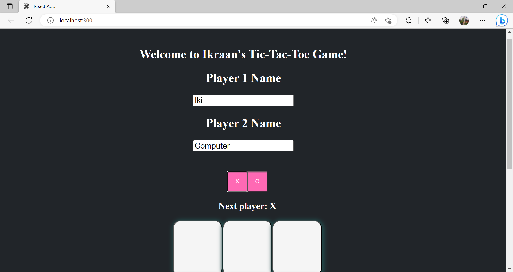
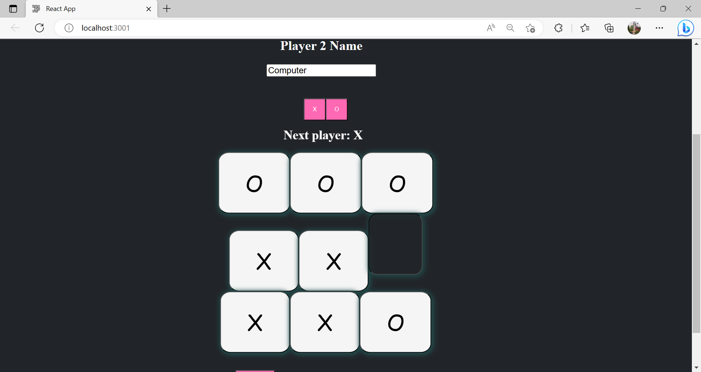
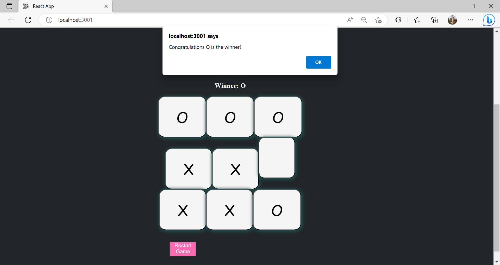

# Tic-Tac-Toe
This is a web-based Tic-Tac-Toe game built using React Javascript Html and Css.

# Features
- Player vs computer
- Responsive design for various screen sizes

# Installation
- Clone the repository
- Install dependencies for the client
- Start the client
- Open your browser and navigate to http://localhost:3001 to play the game.

# Usage
Once the application is running, simply navigate to http://localhost:3001 in your browser to start playing the game.

# Dependencies
- Node.js
- Express
- React
- React Router

# Screenshots
Home Screen: 

Enter Player Names:

Select Play of Choice:

Play Game:

Declaring Winner: 
